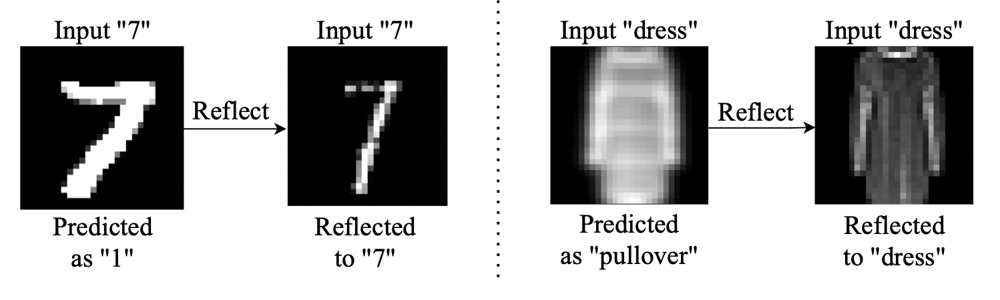
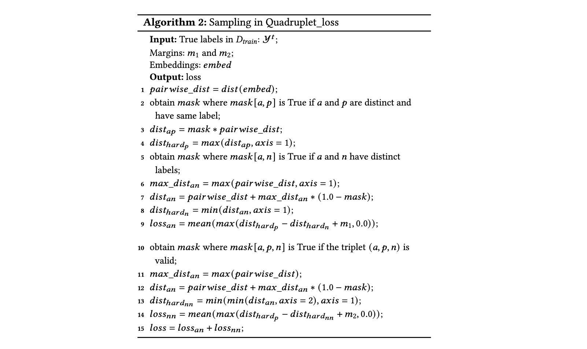

<h1 align="center">InputReflector</h1>


<p align="center">
<b>
A runtime approach that mitigates
DNN mis-predictions caused by the unexpected inputs to
the DNN.</b>
<br/><br/>
<a href=""></a>


<p align="center">
Code release and supplementary materials for:</br>
  <b>"Repairing Failure-inducing Inputs with Input Reflection"</b></br>
    The 37th IEEE/ACM International Conference on Automated Software Engineering (<b>ASE 2022</b>)
    <br />
    <a href="https://yanxiao6.github.io/">Yan Xiao</a>
    ·
    <a href="http://linyun.info">Yun Lin</a>
    ·
    <a href="https://www.cs.ubc.ca/~bestchai/">Ivan Beschastnikh</a>
    ·
    <a href="https://sunchangsheng.com">Changsheng Sun</a>
    <br/>
    <a href="https://cs.gmu.edu/~dsr/">David S. Rosenblum</a>
    ·
    <a href="https://www.comp.nus.edu.sg/~dongjs/">Jin Song Dong</a>
    <br/><br/>
    <a href="https://www.comp.nus.edu.sg"> </a>  <br/>
    <a href="">  </a>
    <a href="">  </a>
    <br/><br/>
  </p>


<p align="center">
    <!-- <a href="https://pytorch.org/get-started/locally/"></a>
    <a href="https://pytorchlightning.ai/"></a><br><br> -->
    <a href='http://linyun.info/publications/ase22.pdf'>
      
    </a>
    <!-- <a href='https://arxiv.org/abs/2103.02371'>
      
    </a>  -->
    <a href='https://trustdnn.comp.nus.edu.sg'>
      
    <a href='https://youtu.be/'>
      
    </a>
    <!-- <a href='https://colab.research.google.com/drive/' style='padding-left: 0.5rem;'>
      
    </a>
    <a href='https://discord.gg/' style='padding-left: 0.5rem;'>
       -->
    </a>
  </p>
</p>


## Repo structure
- `resnet.py`: code for Resnet-20 to train the subject models
- `train_model.py`: code for ConvNet and VGG-16 to train the subject models
- `special_transformation.py`: code for transformations
- `seek_degree.py`: find the cornel degrees for each transformation
- `train.py`: train inputreflector
- `triplet_loss`: loss functions
- `eval.py`: obtain distances between given instances and training data
- `collect_auroc_sia.py`: generate AUROC from the distance
- `search_threshold_quad.py`: search for the best threshold of detecting deviated data on the validation dataset and calculate the model accuracy after calling InputReflector

## Dependencies
pip install -r requirements.txt

## How to run

- To train the subject models and InputReflector: bash log.sh
- To evaluate the performance of InputReflector: bash log_eval.sh


## Supplementary
### Sampling in Quadroplet Loss

In Section 3.2.1, InputReflector uses Quadruplet network for the reflection process. During the construction of the Quadruplet network, the challenge is how to sample the quadruplet from the training data. Algorithm 2 discusses how to mine quadruplet samples during training. The sample mining process of the Siamese network in Section 3.1 also uses this technique. We omit Algorithm 2 due to space limitation.



The loss of the Quadruplet network consists of two parts (Line 15 in Algorithm 2). The first part, <!-- $loss_{an}$ --> , is the traditional triplet loss that is the main constraint. The second part, <!-- $loss_{nn}$ --> , is auxiliary to the first loss and conforms to the structure of traditional triplet loss but has different triplets. We use two different margins (<!-- $m_{1} > m_{2}$ --> ) to balance the two constraints. We now discuss how to mine triplets for each loss.

First, a 2D matrix of distances between all the embeddings is
calculated and stored in <!-- $pairwise\_dist$ -->  (line 1). Given an anchor, we define the *hardest positive example* as having the same label as the anchor and whose distance from the anchor is the largest (<!-- $dist_{hard_{p}}$ --> ) among all the positive examples (lines 2-4). Similarly, the *hardest negative example* has a different
label than the anchor and has the smallest distance from the anchor (<!-- $dist_{hard_{n}}$ --> ) among all the negative examples (lines 5-8). These *hardest positive example* and *hardest negative example* along with the anchor are formed as a triplet to minimizing <!-- $loss_{an}$ -->  in line 9. After convergence, the maximum intra-class distance is required to be smaller than the minimum inter-class distance with respect to the same anchor. 

To push away negative pairs from positive pairs, one more loss, <!-- $loss_{nn}$ --> , is introduced.
Its aim is to make the maximum intra-class distance smaller than the minimum inter-class distance regardless of whether pairs contain the same anchor. This loss constrains the distance between positive pairs (i.e., samples with the same label) to be less than any other negative pairs (i.e., samples with different labels that are also different from the label of the corresponding positive samples). With the help of this constraint, the maximum intra-class distance must be less than the minimum inter-class distance regardless of whether pairs contain the same anchor. To mine such triplets, the valid triplet first needs to be filtered out on line 10 where <!-- $i, j, k$ -->  are distinct and 

<!-- $(labels[i] \neq labels[j]) \ \& \ (labels[i] \neq labels[k]) \ \& \ (labels[j] \neq labels[k])$ --> 


Then, the hardest negative pairs are sampled whose distance is the minimum among all negative pairs in each batch during training (line 11-13).  Finally <!-- $loss_{an}$ -->  is minimized to further enlarge the inter-class variations in Line 14.


## Citation
```bibtex
@inproceedings{xiao2022repairing,
  title={Repairing Failure-inducing Inputs with Input Reflection},
  author={Xiao, Yan and Lin, Yun and Beschastnikh, Ivan and Sun, Changsheng and Rosenblum, David S and Dong, Jin Song},
  booktitle={2021 37th IEEE/ACM International Conference on Automated Software Engineering (ASE)},
  year={2022},
  organization={IEEE}
}
```

## License
This code and model are available for non-commercial scientific research purposes as defined in the [LICENSE](LICENSE) file. By downloading and using the code and model you agree to the terms in the [LICENSE](LICENSE).

## Contact

For more questions, please contact <cssun@u.nus.edu>.